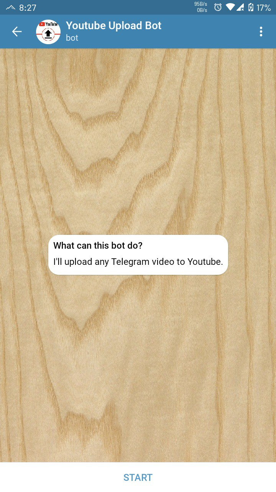
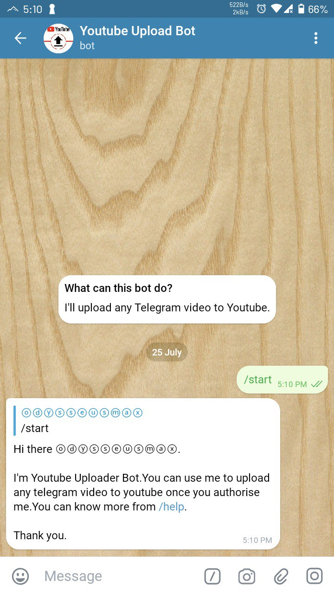
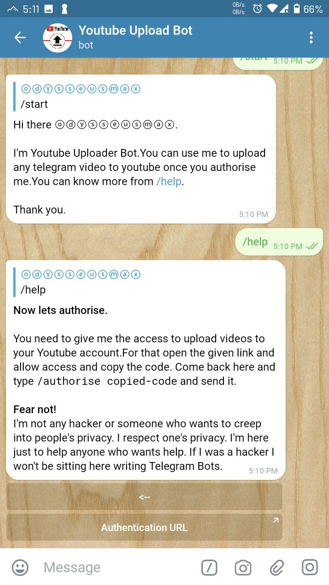
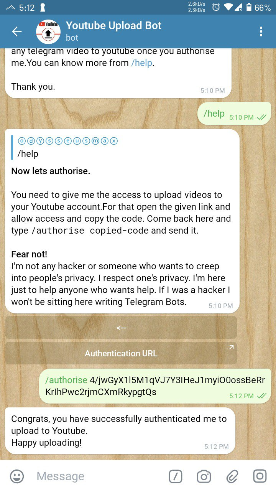
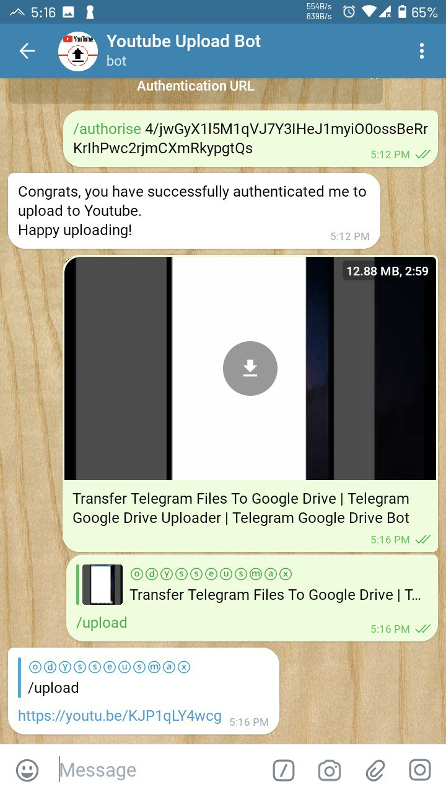

# [Youtube Uploader Bot](https://tx.me/youtubeitbot)

> Simple [Telegram Bot](https://core.telegram.org/bots "Telegram Bots") to Upload videos to [Youtube](https://youtube.com "YouTube") written in Python3.

**Easy way of directly deploying to heroku**

**Environment Variables**

* `BOT_TOKEN`(Required) - Get your bot token from [Bot Father](https://tx.me/BotFather "Bot Father").
* `SESSION_NAME`(optional) - Your bot's username.
* `API_ID`(Required) - Your telegram api id, get from [Manage Apps](https://my.telegram.org).
* `API_HASH`(Required) - Your telegram api hash, get from [Manage Apps](https://my.telegram.org).
* `CLIENT_ID`(Required) - Your google client id.
* `CLIENT_SECRET`(Required) - Your google client secret.
* `BOT_OWNER`(Required) - Telegram id of bot owner.
* `AUTH_USERS`(optional) - Telegram id's of authorised users, separated by `,`.
* `VIDEO_DESCRIPTION`(optional) - Any default description to be aded to the video.
* `VIDEO_CATEGORY`(optional) - YouTube's video category id. If not specified or specified id is invalid, category id will be selected randomly.
* `VIDEO_TITLE_PREFIX`(optional) - Any prefix to be added to the video's title.
* `VIDEO_TITLE_SUFFIX`(optional) - Any suffix to be added to the video's title.
* `UPLOAD_MODE`(optional) - The video's privacy status. Valid values for this property are: `private`, `public`, `unlisted`.
* `DEBUG` (optional) - Whether to set logging level to DEBUG. If set logging will be set to DEBUG level, else INFO level.

**Getting your `CLIENT_ID` and `CLIENT_SECRET`**

* Head to [Google console](https://console.developers.google.com "Google console"), create a new project named `Youtube Uploader` and enable `API'S AND SERVISES`. Search for `YOUTUBE DATA API v3` and enable the API. Go to [Credentials](https://console.developers.google.com/apis/credentials "Credentials") page, select your project `Youtube Uploader` create a new credential with `desktop` as type. Copy the `CLIENT_ID` and `CLIENT_SECRET`. 
* You have to verify your application with google, only then you can make the uploaded videos public. YouTube changed its developer policy, and videos uploaded using unverfied applications will be kept private.

### Development Status

This project is actively maintained and will continue so until I'm tired of it.

### Special notes

* With the Youtube Data API you are awarded with 10,000 points of requests. For one video upload it costs 1605 points, regardless of file size, which calculates to about 6 uploads daily. Once you have exhausted your daily points, you have to wait till daily reset. Resets happens at 0:00 PST, i.e. 12:30 IST. So make your uploads count.

* Uploading copyright contents will leads to immediate blocking of the video.

* By default, all the videos are uploaded as private with random category id unless you provide `UPLOAD_MODE` and `VIDEO_CATEGORY`. You may change it after youtube processes the video.

### Screenshots

### Video Tutorial

Here's a YouTube tutorial video for deploying the bot on [Heroku](https://heroku.com/ "Heroku"). [Video Link](http://www.youtube.com/watch?v=LSs8b5dMWIA "Tutorial video for deploying to Heroku").

### Contact

You can contact me [@odysseusmax](https://telegram.dog/odysseusmax "odysseusmax").

### License
Code released under [GNU General Public License v3.0](LICENSE).
